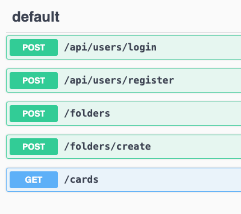

# Project d'API de gestion de fichiers de type "Drive"

## Sujet

- L'utilisateur doit avoir un compte ou créer un compte pour utiliser le service
- Possibilité d'uploader, télécharger, modifier et supprimer les fichiers
- Possibilité de créer des dossiers et de placer les fichiers dans les dossiers
- Possibilité de partager des fichiers pour d'autres utilisateurs via leur email
- Lien de partage public et génération de l'image QRCode de ce lien

## Outils et librairies utilisés

- [jest est une librairie test runner et un test runner](https://dev.to/nathan_sheryak/how-to-test-a-typescript-express-api-with-jest-for-dummies-like-me-4epd)
    - Librairie test: permet de définir des tests dans le code (`expect`, `test`, etc.)
    - Test runner: permet d'exécuter des tests et de générer un rapport à la fin
- [prettier et .prettierrc](https://github.com/jonas-pietzsch/node-express-typescript-boilerplate/blob/master/.prettierrc): permet d'automatiquement appliquer des convention de programmation.
- [TypeScript et son fichier de configuration tsconfig.json](https://www.typescriptlang.org/docs/handbook/tsconfig-json.html)
- [docker-compose.yml](https://docs.docker.com/compose/intro/features-uses/) permet de configurer [l'image BDD postgres](https://www.docker.com/blog/how-to-use-the-postgres-docker-official-image/) utilisée pour l'environnement de dev
    - Installer docker et docker-composer ou podman et podman-compose
    - Instructions pour podman: `scoop install podman` puis `pip3 install podman-compose` ou `pip install -r requirements.txt`
- [dotenvx permet d'avoir plusieurs fichiers d'environnements](https://github.com/dotenvx/dotenvx). Consulter la partie `scripts` dans package.json pour voir des exemples d'utilisation (exemple plus bas en annexe).
- [sequelize-typescript](https://www.npmjs.com/package/sequelize-typescript) est un ORM basé sur sequelize et optimisé pour TypeScript.
- `tsoa` (json open api) + Swagger UI. tsoa permet de générer la documentation de l'API au formats openAPI ou swagger. Swagger UI permet de générer l'interface web qui permet d'explorer
    - [tuto1](https://medium.com/ms-club-of-sliit/building-rest-api-with-express-js-typescript-and-swagger-387a9c731717)
    - `Concurrently` permet de de lancer deux plusieurs tâches en temps. Il nous sert à lancer en même temps la génération du fichier openAPI et l'exécution du serveur de dev.
    - Utiliser [sequelize-typescript](https://www.npmjs.com/package/sequelize-typescript) pour une meilleure intégration avec tsoa comparé à sequelize
- Journalisation des appels avec le middleware [Morgan](https://www.npmjs.com/package/morgan)
- Gestion du content-type de type `multipart/form-data` avec [multer](https://expressjs.com/en/resources/middleware/multer.html). Cette librairie permet de récupérer certaines parties du body dans dans des fichiers, ce qui est utile pour implémenter la fonctionnalité d'upload.
- [Passport.js](https://www.passportjs.org/) et [passport-jwt](https://www.passportjs.org/packages/passport-jwt/), permettent de rajouter un middleware qui vérifie la présence du token jwt dans le header `Authorization` sur les routes qu'on souhaite protéger. Il nous donne ainsi la possibilité de renseigner le champ `req.user` avec l'utilisateur courant.
- [jsonwebtoken](https://www.npmjs.com/package/jsonwebtoken) permet de générer un JWT
- Penser à faire un `npm i --save-dev @types/[librariejs]` pour qu'elle soit mieux reconnue et documentée quand on code en TypeScript. Par exemple `npm i --save-dev @types/morgan @types/jsonwebtoken`.

## Annexe

- Exemple de fichier de configuration d'un environnement de dev

```txt
ENVIRONMENT=dev
DB_DIALECT=postgres
DB_USER=dev_user
DB_PASSWORD=dev_pwd
DB_DATABASE=awesomeapi
```

- Exemple d'interface swagger


